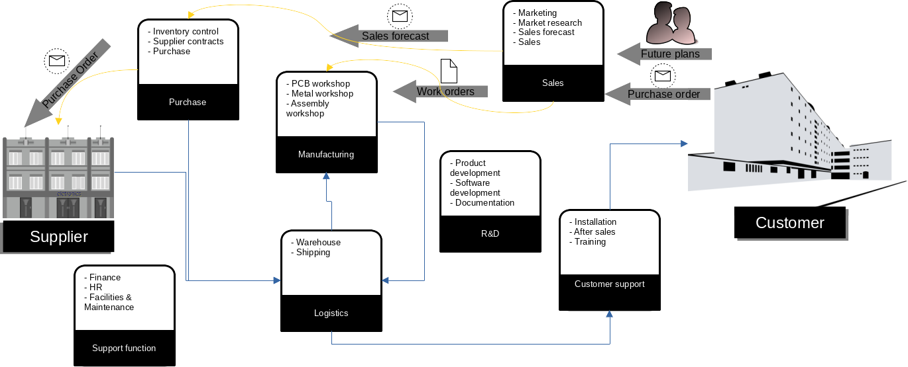

# 02 Process

## Company structure

Kartano Tech Oy is organized in seven departments, aiming to provide the best service to each customer. The department organization is arranged in a way the information from customer reach the first departments in charge of initialize the manufacturing process and goes until the product is delivered to the customer.
### Sales department
All the Customer Relationship Management, is performed by the Sales Department. This includes: Marketing, Market research, Sales forecast and finally the transaction itself. Sales provide a forecast to purchase department in order to anticipate quotations or even the purchase in case the company management decide to take the risks and purchase raw material before receive an order. When a purchase order is received, a **Work Order** is created and assigned to Manufacturing.
### Purchase department
Control the raw material inventory, relationship with suppliers and place the purchase orders

### Logistics
Manage the warehouse, receive goods and take care of packaging and shipment of final products to customers.

### Customer support
Take care of the customer experience, by organizing installations, trainings and any other customer need during the product life-cycle.

### Manufacturing
The production process is divided in three main workshops responsible for the **core** manufacturing of the company products. The PCB workshop, produce the *printed circuit board*. The Metal workshop, produce the device case and internal parts. Both departments supply the produced parts back to warehouse on which the parts become a sub-component. The Assembly workshop, work based on work orders, when all materials are available. When the WO is completed, the product is forward to the Logistics department.

### Support function 
Company general management and administrative tasks are performed by support functions that report directly to management, this include Finance, HR, Facilities & Maintenance.

### Research & Development
The most important asset of the company is the intellectual property of the product, that include the software. As well the capability to develop further the products. The R&D department is responsible for product development as well is integrate in the manufacturing process to assure quality and collect feedback for improvements. Another source of information for R&D is sales and customer service.

## Forecast and Order entry
The existing process of collecting information about customer *future plans*, possible leads, opportunities and converting into a sales forecast to allow purchase negotiate in advance or even manufacturing plan resources. It's completely informal and without traceability of updates. When sales department achieve certain confiadenciality about a new contract, they send a *Heads up* email, to inform internally. A customer can place a purchase order (PO) at any moment, most of the cases is through an email.    
Sales process the PO adding into excel file to control and follow up invoice process, also a *work order* (WO) is created, printed and delivered to the Manufacturing department. Which will create the *Bill of Materials* (BOM) and a person will walk to the Warehouse to pickup the material and inform the warehouse team which materials and quantities are beign consumed.

## Functional Requirement Specification
The existing process is completely manual, traceability relies on the email historic data. Relation between manufacturing and warehouse is prone to failure, resulting on incorrect information about stock level, that can cause material shortage, causing production stop and late deliveries.    
The *nice to have* feature in an ERP system is a **CRM** module to support Sales in getting sales deals close andmost important, provide reliable information to purchase department. The next module that is mandatory is the **Manufacturing** on which all the operation will be controlled. by having a manufactuing module, others modules are also needed to compliment the functionality of the ERP system, as: Stock and Sales.

[back HOME](https://code.33co.de/ehofmann/ERP-samk)