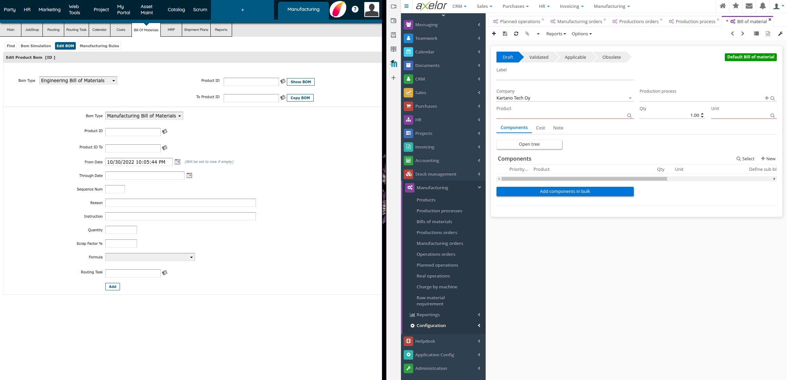
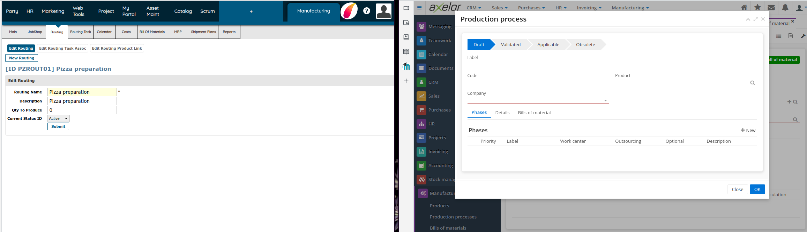
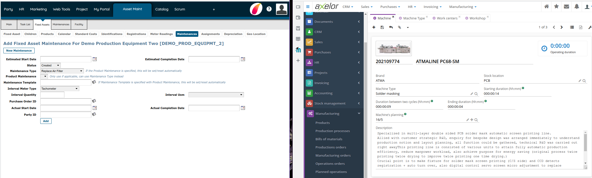

# Axelor vs Apache OFBiz
Back to the task of [selecting an open-source ERP system](https://code.33co.de/ehofmann/ERP-samk/issues/19), between six solutions identified, three were selected
- [Axelor](https://axelor.com/erp/)
- [ERPNext](https://erpnext.com/)
- [OFBiz](https://ofbiz.apache.org/)    
Axelor was selected for testing purpose and an instance has been installed in a virtual machine and can be accessed [here](https://erp.33co.de).    

## Comparison methodology
For the purpose of the [assigment 3.4](assigments/assigment3.md)
> 4. Find at least two ERP suppliers', present their commercial module names and find similarities and differences between these two suppliers' modules.     
I will compare based on the user interface, matching similarities and differences. Between the implementation of [Axelor](https://erp.33co.de) and [OFBiz](https://demo-stable.ofbiz.apache.org/manufacturing/control/main).

## Side by Side
### BOM Bill Of Materials

The first impression, by evaluating side by side the Bill Of Material interface, inside the **Manufacturing** module, it's possible to notice two subtle differences. OFBiz has more technical approach by adding *Scrap Factor %* and Axelor has more costing options.


Another visible terminology and implementation differences, is the way to describe how the product will be manufactured, step by step. On Axelor the term *Production process* is used. In OFBiz the term *Routing* is used. Nevertheless, Axelor has a broad approach of the product process, it can be several steps, divided in phases.  

### Machines
A very peculiar difference that enter in the *Nice to Have* feature, is the approach of OFBiz regarding the machines.    
Axelor deal with the machinery in this sequence ```Workshop -> Machine Types -> Machines -> Work centers```.It's possible to provide basic information like serial number and production cycle time. In other approach, OFBiz consider machinery as an Asset. Having an dedicated user interface for this feature. Also know as maintenance module. 


Beyond the basic information regarding the equipment, it's possible to follow up machine usage, by adding *Meter Readings* and maintenance performed in the equipment. Depreciation and Geo location are additional features.   

#### Personal experience 
This is a good example when a company decide to use or not use a module. I'm been working with Engineering and Maintenance during my entire career. Already, I saw many ERP implementation and never the so called "Maintenance" module has been implemented. This happened with first versions of [MFG/PRO](https://www.qad.com/mfgpro) and more recent versions of [QAD](https://www.qad.com/). Even on latest change to [Oracle ERP](https://www.oracle.com/scm/#rc30maint). Maintenance module has been left out of the package. Reasons:
1. Cost over 200.000USD. Difficult to justify the investment based on real ROI that the system can bring based on the module limitations/coverage.
2. Not attend the end user needs, meaning the maintenance technician and management staff.     

A [Computerized maintenance management system](https://www.ibm.com/topics/what-is-a-cmms) or CMMS has much more features that really attend the objective of a maintenance team. Maintain equipment in perfect working conditions. This explain the reasons behind to not chose all the module offered by a single ERP supplier and implement different solutions to specific use case.

---
[back Assignment 3](03Module.md)

[back HOME](https://code.33co.de/ehofmann/ERP-samk)