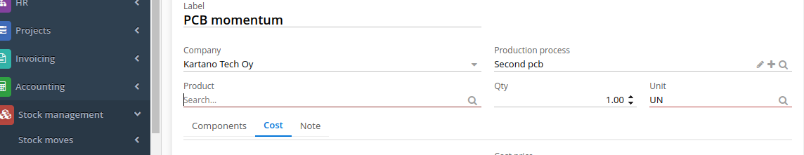
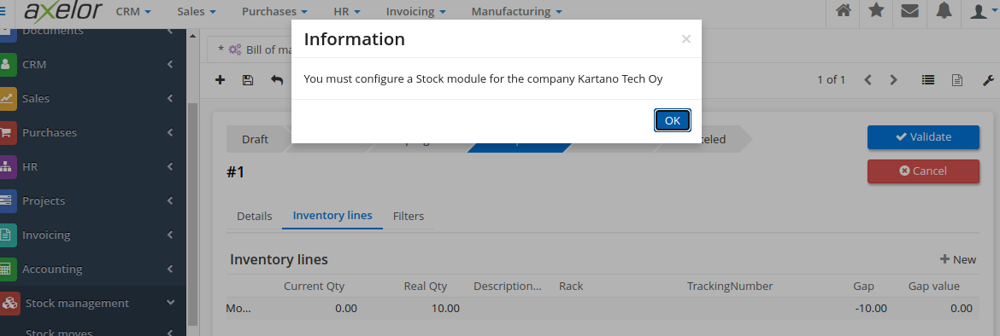
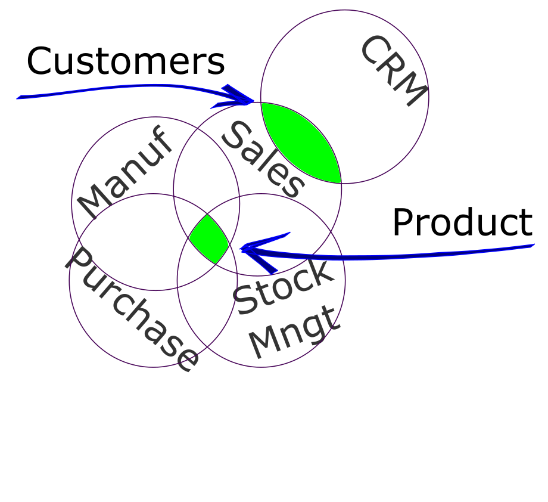
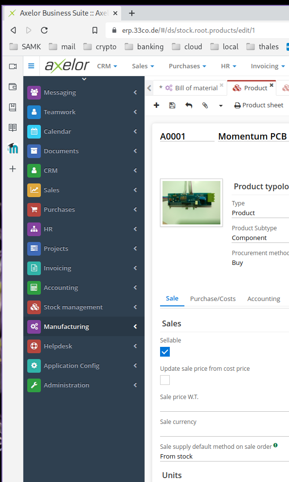

# 03 Modules & more

An ERP system from a single vendor can be the only system in use by a company or a part, a component, of the entire ERP solution of a company that use several vendors. Each ERP system is conceived as a group of modules, that interact with information flow between the modules ou exporting and importing data between different solutions.

## Learning by doing
In order to evaluate one module, for this exercise the **Manufactuing** module, the approach is to configure the module and identify the interaction with others modules as well the difficulties or pecularities during the task execution.

## Module Configuration
Setting up a **Manufacturing** module require a keen eye on details, but sometimes not so detailed in order to avoid complications.    
The sequence to setup the module on my testing [axelor ERP](https://erp.33co.de) instance is the following:
1. Setup Country, City, Company information
2. Create workshop, in [Kartano Tech Oy](https://code.33co.de/ehofmann/ERP-samk/src/branch/master/02Process.md) case is the PCB Workshop, Metal Workshop and Assembly Workshop
3. Add cancel reasons, during setup I do not know what is the need of such *Cancel Reasons*, I considered as issues in production that could cancel an order
4. Product approvals, in this item I created inspection step that will approve the product, to be validated at the end.
5. Machine types. In this case I added twelve type of machines that are necessary to create PCB *"Printed Circuit Boards"*
6. Machines. Here I added the machine that is producing according each manufacturing step. Each machine belong to a *Machine Type* group.
7. Work Centers. Here machines are grouped in order to produce the product, also capacity and costing settings are defined. I will need to return to this settings after adding products to the system, as this information is necessary to define the process cost.

### Creating orders
Still some configurations are empty or not clear what are the requirements, by checking the [documentation](https://docs.axelor.com/abs/5.0/functional/manufacturing.html#introduction) I decide to follow the manual flow and configure the product.

### Integration
Several occasions during the configuration of the **Manufacturing** module, it become difficult to advance, because it needs information provided by another module. To create a *work order* is necessary to create a product first.

A product can be created in either of these modules **Manufacturing** module or in the **Stock Management** module or even on **Sales** module. On each of these modules there are some additional info related to the product and the module in use. The image below show the message when a product was being created in the **Stock Management** module and the module is not configured.

There is no way we can achieve a minimalist implementation of an ERP system with a single module. When dealing with customers, a **Sales** module is mandatory, but in a situation the company has an established sales team. 

Adding a **CRM** module will benefit the data in the system and the sales team work. For these two separate modules the common information is the *Customers*, on each module there is some specific data, but the common information is shared between both modules. *Product* is another information item of an ERP that is used across several modules. In the **Sales** module the most important information is the cost price, yet on **Stock Management** the inventory and location are a key information. 

## Selection

Thinking in an [SME](https://www.investopedia.com/terms/s/smallandmidsizeenterprises.asp) on which people work with machines to create products that are stored in a warehouse and then sold to customers, at least these modules are mandatory:
- Manufacturing
- Stock Management
- Sales
- Purchase    
Not vital modules, but the use of these modules will allow the company become more organized, with process flows and standards procedures are:
- CRM
- HR
- Invoicing
- Accounting     
These selections are for a product oriented company, a service company would priorize more Sales and Stock Management. 
This is the benefit of modules, a company can select the ones that fit the correct purpose of the business activity.

