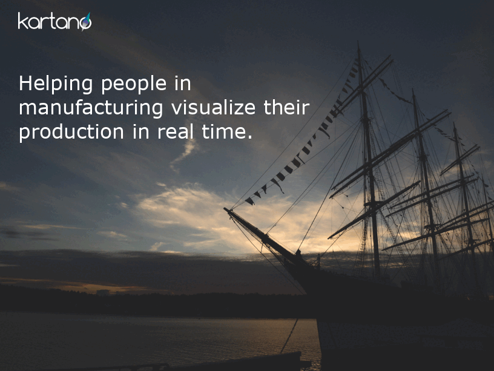

# Management presentation
> 09. October 2022    
> By: Eduardo Luis Hofmann    
> [Presentation Slides](01presentation.md)

## Presentation

## Keynotes

Kartano Tech Oy revenue model is based on subscription model, *Freemium* subscription is part of the offer with limited features.   
The business model consider a exponential grow in the first three years. To allow breakeven in the third year.
  

### CSF
The **Critical Success Factors** for Kartano Tech Oy are a *Effective customer on-boarding*, this means that people are aware of the company product and are subscribing to the service. The next factor is the *Customer conversion*, the customer that just subscribe need to became a paid subscriber. In a nutshell, company need new people and company need that the new people became a subscriber.
  
### KPI
  
In order to monitor that the company is on track with the plan and actions, the main KPIs, focus on what matter most at the current stage of the company: **Customers, Customer conversion and Production**    
  
### ERP project KPI    
  
In order to follow up the ERP project implementation the following KPIs shall demonstrate the status of the project:    
- Training    
- Data conversion    
- Manual order vs ERP orders    
- Weekly audit    
  
 
